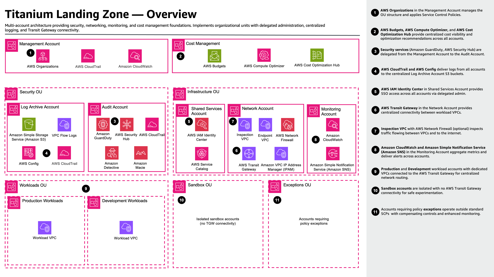
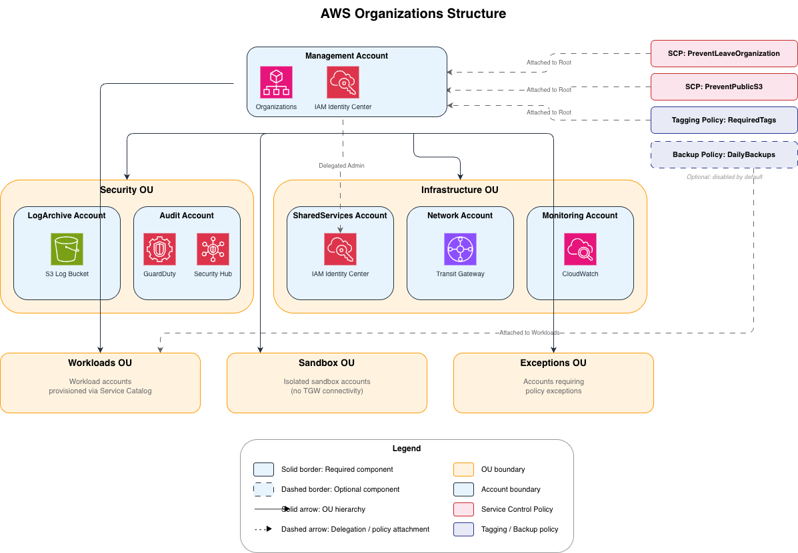
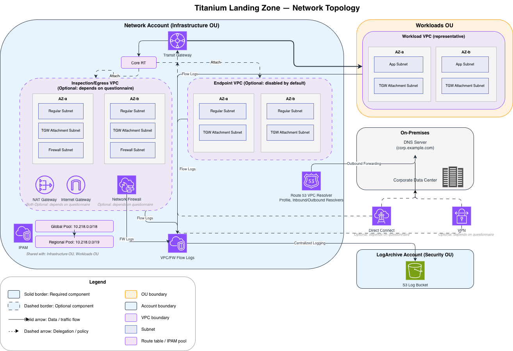
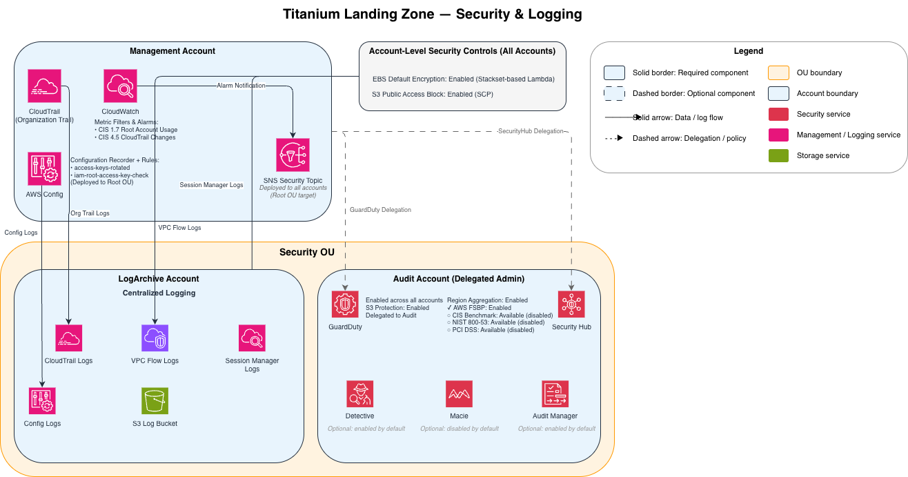
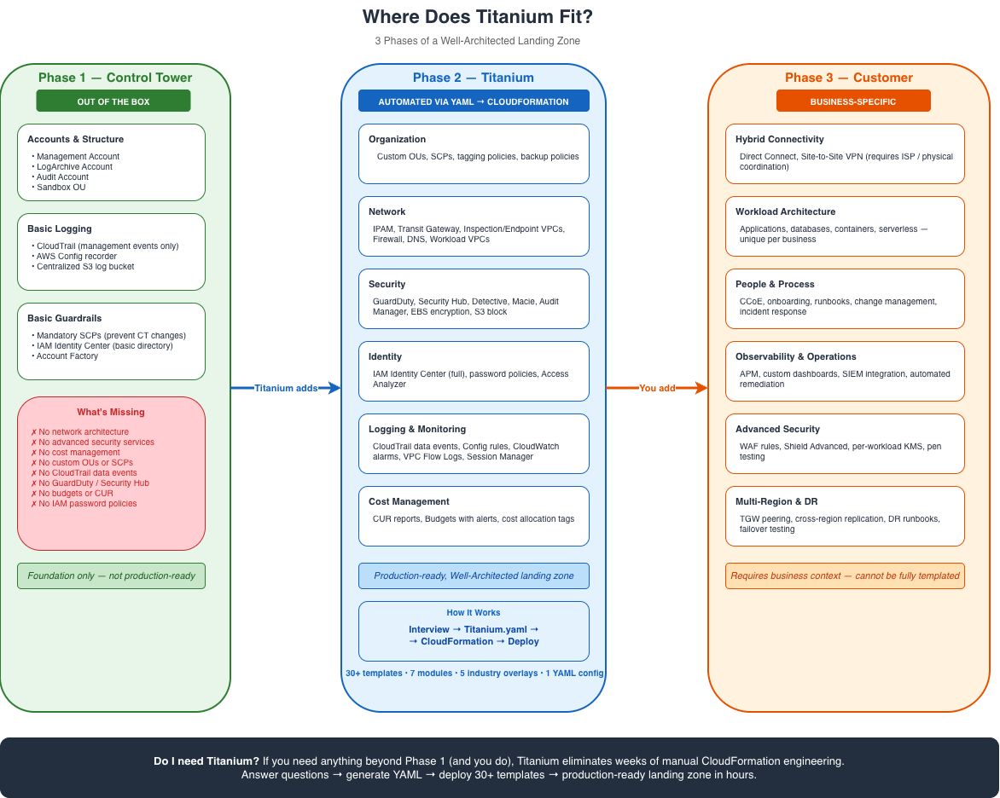
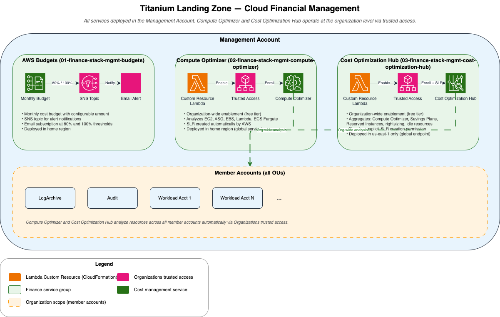

# Titanium Landing Zone — Architecture Diagrams

This directory contains six architecture diagrams that visualize the AWS Landing Zone deployed by Titanium. Each diagram covers a different aspect of the reference architecture defined in `Titanium.yaml`.

## Diagrams

| # | Diagram | Description |
|---|---------|-------------|
| 1 | [Overview](./01-overview.drawio) | High-level summary of accounts, OUs, networking, security, and cost management services |
| 2 | [Organization](./02-organization.drawio) | AWS Organizations hierarchy, SCPs, tagging policies, and backup policies |
| 3 | [Network](./03-network.drawio) | Transit Gateway topology, VPCs, subnets, IPAM, and hybrid connectivity |
| 4 | [Security & Logging](./04-security.drawio) | Security services, delegation model, and centralized log flows |
| 5 | [Titanium Value Proposition](./05-titanium-value-proposition.drawio) | 3 phases: Control Tower baseline → Titanium automation → Customer responsibility |
| 6 | [Finance](./06-finance.drawio) | Cloud Financial Management: Budgets, Compute Optimizer, and Cost Optimization Hub |

## 1. Overview

## 2. Organization

## 3. Network

## 4. Security & Logging

## 5. Titanium Value Proposition

## 6. Finance

## Editing the Diagrams

The `.drawio` source files are the authoritative versions. To edit:

1. Open any `.drawio` file in [draw.io Desktop](https://github.com/jgraph/drawio-desktop/releases) or [diagrams.net](https://app.diagrams.net/)
2. Make your changes
3. Export to PNG at **2x scale** with a white background and 10px padding
4. Save the PNG alongside the source file with the same base name

All AWS service icons use the **AWS 2026** stencil library (`mxgraph.aws4.*`).
